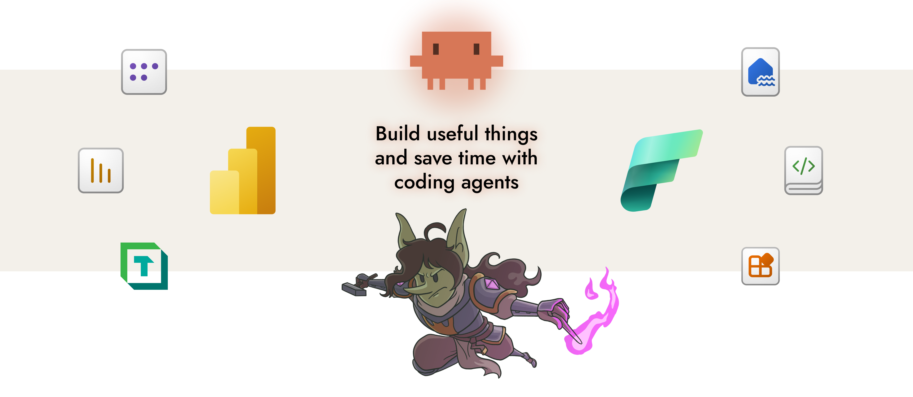

<p align="center">
  
</p>

<h1 align="center">power-bi-agentic-development</h1>

<p align="center">
  The best source for agentic development resources for Power BI in one marketplace <br></br>
  <i> Teach agents like Claude Code or GitHub Copilot to do literally anything in Power BI </i>
</p>

<p align="center">
  
  
  
  
  
</p>

> [!WARNING]
> Under active development with a weekly release cadence; regular renaming or restructuring.

---

### What is agentic development?

- *Agentic development* is when you use agents to help you build, manage, and optimize artifacts and software. This includes semantic models, reports, and the things around them, like workspaces, deployment pipelines, and also processes.
- A *marketplace* hosts *plugins* that you can install. Plugins are a collection of resources that help coding agents perform better. They are typically special instruction files and scripts. Plugins can contain skills, subagents, hooks, and MCP servers focused on special topics or tasks.
- This marketplace is focused on everything to help your agent work well with Power BI and Fabric! Read further for more information.

## Installation

Here's how you get started in Claude Code; run this in the terminal to get the marketplace: 

```bash
claude plugin marketplace add data-goblin/power-bi-agentic-development
```

### Example: Using the pbir-cli with the skills

[Click here for a YouTube walkthrough](https://www.youtube.com/watch?v=acHDorTi62U)

[](https://www.youtube.com/watch?v=acHDorTi62U)

### Claude Code

Add the marketplace, then install plugins via `/plugin` and navigating to the installed marketplace.

<table>
<tr>
<td align="center"></td>
<td align="center"></td>
</tr>
<tr>
<td align="center"><em>Install plugins from the marketplace</em></td>
<td align="center"><em>Enable marketplace auto-update</em></td>
</tr>
</table>

Alternative; add plugins via command line:

```bash
claude plugin install tabular-editor@power-bi-agentic-development
claude plugin install pbi-desktop@power-bi-agentic-development
claude plugin install semantic-models@power-bi-agentic-development
claude plugin install reports@power-bi-agentic-development
claude plugin install pbip@power-bi-agentic-development
claude plugin install fabric-cli@power-bi-agentic-development
```

### Copilot CLI

The standalone [Copilot CLI](https://docs.github.com/en/copilot/how-tos/copilot-cli) supports plugin installation from GitHub repos. Copilot CLI reads the same `.claude-plugin/marketplace.json` manifest this repo uses, so the marketplace and child-plugin layout works without modification.

<details>
<summary><strong>Windows long paths</strong></summary>

TMDL files have a problem with repository-relative paths over 260 characters. Windows' legacy MAX_PATH blocks `git clone` from writing them unless long path support is enabled at both the OS and git level. Without this, `copilot plugin install` aborts with `Filename too long`.

Check [`useful-stuff/agent-scripts/enable-windows-longpaths.ps1`](useful-stuff/agent-scripts/enable-windows-longpaths.ps1) as an example of a script you can run from an elevated ps environment to enable long paths; there are other routes to do this that you can find online, too... just ask Copilot. A reboot is recommended after the registry change. This is a Windows OS limitation, documented at [Maximum Path Length Limitation](https://learn.microsoft.com/en-us/windows/win32/fileio/maximum-file-path-limitation).

See also the below `git config` command:

```powershell
git config --system core.longpaths true
```

</details>

<details>
<summary><strong>Additional installation instructions</strong></summary>

This repository is an [Anthropic-format plugin marketplace](https://code.claude.com/docs/en/plugin-marketplaces) (a set of plugins), not a single distributable plugin, so the root `.claude-plugin/` contains only `marketplace.json`. Two documented install paths work:

**1. Register the marketplace once, then install named child plugins. Example:**

```bash
copilot plugin marketplace add data-goblin/power-bi-agentic-development
copilot plugin install tabular-editor@power-bi-agentic-development
```

**2. Or install a single plugin directly from its subdirectory, no marketplace registration needed. Example:**

```bash
copilot plugin install data-goblin/power-bi-agentic-development:plugins/pbip
```

Both forms are documented in the [Copilot CLI plugin reference](https://docs.github.com/en/copilot/reference/copilot-cli-reference/cli-plugin-reference) and the [plugins how-to](https://docs.github.com/en/copilot/how-tos/copilot-cli/customize-copilot/plugins-finding-installing). Inside an interactive Copilot session, `/plugin install PLUGIN-NAME@MARKETPLACE-NAME` is the equivalent of (1). The bare `copilot plugin install data-goblin/power-bi-agentic-development` (no qualifier) will not install anything useful, because the root is a marketplace catalog, not a plugin.

</details>

<details>
<summary><strong>Verify installation in Copilot CLI</strong></summary>

Inside Copilot CLI:

```
/env                    # Loaded instructions, MCP servers, skills, agents, plugins, LSPs, extensions
/plugin list            # Installed plugins
/skills list            # Available skills
/skills info pbip       # Details for a specific skill
/agent                  # Browse installed agents
```

</details>

<details>
<summary><strong>Compatibility notes</strong></summary>

- **Skills** load identically; Copilot CLI reads `skills/<name>/SKILL.md`.
- **Agents** use the `*.agent.md` extension required by Copilot CLI's documented convention. Claude Code matches any `*.md` file in `agents/`, so the dual extension works in both tools.
- **MCP servers** load from `.mcp.json` (plugin root) or `.github/mcp.json`. The plugins in this repo do not currently ship MCP servers.
- **Hooks** are registered via `hooks.json` and reference scripts using `${CLAUDE_PLUGIN_ROOT}`. Copilot CLI **≥ 1.0.26** (2026-04-14) sets `CLAUDE_PLUGIN_ROOT` for plugin hooks ([changelog](https://github.com/github/copilot-cli/blob/main/changelog.md)); older builds do not, which causes hook commands to resolve to broken paths. Run `copilot update` if hooks fail to fire. Native Windows bash users may also hit a separate path-format bug tracked upstream at [claude-code#11984](https://github.com/anthropics/claude-code/issues/11984).

</details>


## Overview

The repo contains skills, agents, and hooks.

- **Skills** teach agents domain knowledge and workflows. They activate automatically based on task context, or can be invoked manually with `/skill-name`. In Claude Code, skills and commands have coalesced; commands are simply more prescriptive skill workflows.
- **Agents** are autonomous subprocesses that handle complex, multi-step tasks independently; typically used for review and validation.
- **Hooks** run automatically after tool use to validate files and catch errors early. They are deterministic; they fire when a specific pattern is matched, not by LLM judgment.

Hook checks can be individually toggled via config files. Set any check to `false` to disable it:
- `plugins/pbip/hooks/config.yaml` -- PBIR, TMDL, and report binding validation
- `plugins/pbi-desktop/hooks/config.yaml` -- DAX references, measure metadata, referential integrity, metadata cache

### Available plugins for Power BI and Fabric

<details>
<summary> <strong>tabular-editor</strong> &ensp; BPA rules, C# scripting, and CLI automation for Tabular Editor</summary>

| Type | Name | Description |
|------|------|-------------|
| Skill | [`bpa-rules`](plugins/tabular-editor/skills/bpa-rules/) | Create and improve Best Practice Analyzer rules for models |
| Skill | [`c-sharp-scripting`](plugins/tabular-editor/skills/c-sharp-scripting/) | C# scripting and macros for TE |
| Skill | [`te2-cli`](plugins/tabular-editor/skills/te2-cli/) | Tabular Editor 2 CLI usage and automation (not TE3) |
| Skill | [`te-docs`](plugins/tabular-editor/skills/te-docs/) | Tabular Editor documentation search, TE3 config files. Uses [`pbi-search`](https://github.com/data-goblin/pbi-search) CLI |
| Command | [`/suggest-rule`](plugins/tabular-editor/commands/suggest-rule.md) | Generate BPA rules from descriptions |
| Agent | [`bpa-expression-helper`](plugins/tabular-editor/agents/bpa-expression-helper.agent.md) | Debug and improve BPA rule expressions |

</details>

<details>
<summary> <strong>pbi-desktop</strong> &ensp; Connect to, query, and modify models in Power BI Desktop</summary>

| Type | Name | Description |
|------|------|-------------|
| Skill | [`connect-pbid`](plugins/pbi-desktop/skills/connect-pbid/) | Explore, query, and modify a model in Power BI Desktop |
| Agent | [`query-listener`](plugins/pbi-desktop/agents/query-listener.agent.md) | Capture DAX queries from Power BI Desktop visuals in real time |
| Hook | DAX reference validation | Validates table, column, and measure references against the connected model; suggests corrections |
| Hook | Measure metadata enforcement | Blocks adding measures without DisplayFolder, Description, and FormatString |
| Hook | Referential integrity check | Reports unmatched many-side keys after relationship or column changes |
| Hook | Metadata cache refresh | Auto-snapshots model metadata on TOM connect or model modification |
| Hook | Compatibility level check | Reports features available by upgrading; optional auto-upgrade |

</details>

<details>
<summary> <strong>pbip</strong> &ensp; Author and validate TMDL, PBIR, and PBIP project files</summary>

| Type | Name | Description |
|------|------|-------------|
| Skill | [`pbip`](plugins/pbip/skills/pbip/) | Power BI Project (PBIP) format, structure, and file types |
| Skill | [`tmdl`](plugins/pbip/skills/tmdl/) | Author and edit TMDL files directly |
| Skill | [`pbir-format`](plugins/pbip/skills/pbir-format/) | Author and edit PBIR metadata files directly (visual.json, report.json, themes, filters, report extensions, visual calculations) |
| Agent | [`pbip-validator`](plugins/pbip/agents/pbip-validator.agent.md) | Validate PBIP project structure, TMDL syntax, and PBIR schemas |
| Hook | PBIR validation | Validates PBIR structure, required fields, naming conventions, and schema URLs |
| Hook | Report binding validation | Validates semantic model binding (byPath directory exists; byConnection model exists via `fab exists`) |
| Hook | TMDL validation | Validates TMDL structural syntax |

</details>

<details>
<summary> <strong>reports</strong> &ensp; Deneb, R, Python, SVG visuals; themes; report design and review</summary>

| Type | Name | Description |
|------|------|-------------|
| Skill | [`pbi-report-design`](plugins/reports/skills/pbi-report-design/) (Very WIP) | Power BI report best practices, design and style |
| Skill | [`modifying-theme-json`](plugins/reports/skills/modifying-theme-json/) (WIP) | Working with theme files |
| Skill | [`deneb-visuals`](plugins/reports/skills/deneb-visuals/) | Deneb visuals with Vega and Vega-Lite specs |
| Skill | [`r-visuals`](plugins/reports/skills/r-visuals/) | Custom R visuals in Power BI reports |
| Skill | [`python-visuals`](plugins/reports/skills/python-visuals/) | Custom Python visuals in Power BI reports |
| Skill | [`svg-visuals`](plugins/reports/skills/svg-visuals/) | SVG visuals via DAX measures in Power BI reports |
| Skill | [`review-report`](plugins/reports/skills/review-report/) (WIP) | Review Power BI reports for usage metrics and best practices |
| Skill | [`pbir-cli`](plugins/reports/skills/pbir-cli/) | Programmatic report manipulation via the [`pbir` CLI](https://github.com/maxanatsko/pbir.tools) |
| Agent | [`deneb-reviewer`](plugins/reports/agents/deneb-reviewer.agent.md) | Review Deneb visual specs for Vega/Vega-Lite syntax and conventions |
| Agent | [`svg-reviewer`](plugins/reports/agents/svg-reviewer.agent.md) | Review SVG DAX measures for syntax and design quality |
| Agent | [`r-reviewer`](plugins/reports/agents/r-reviewer.agent.md) | Review R visual scripts (ggplot2) for Power BI conventions |
| Agent | [`python-reviewer`](plugins/reports/agents/python-reviewer.agent.md) | Review Python visual scripts (matplotlib/seaborn) for Power BI conventions |

</details>

<details>
<summary> <strong>semantic-models</strong> &ensp; DAX, Power Query, naming, lineage, refresh, and model auditing</summary>

| Type | Name | Description |
|------|------|-------------|
| Skill | [`standardize-naming-conventions`](plugins/semantic-models/skills/standardize-naming-conventions/) | Audit and standardize naming conventions in semantic models |
| Skill | [`review-semantic-model`](plugins/semantic-models/skills/review-semantic-model/) (Very WIP) | Review semantic models for quality, performance, AI readiness, and best practices |
| Skill | [`refreshing-semantic-model`](plugins/semantic-models/skills/refreshing-semantic-model/) | Trigger or troubleshoot refreshes |
| Skill | [`lineage-analysis`](plugins/semantic-models/skills/lineage-analysis/) | Trace downstream reports from a semantic model across workspaces |
| Skill | [`power-query`](plugins/semantic-models/skills/power-query/) | Write M expressions, debug query folding, execute M locally or via Fabric API |
| Skill | [`dax`](plugins/semantic-models/skills/dax/) | Write, debug, and optimize DAX in semantic models. Contributed by [Justin Martin](https://daxnoob.blog) |
| Agent | [`semantic-model-auditor`](plugins/semantic-models/agents/semantic-model-auditor.agent.md) | Audit semantic models for quality, memory, DAX, and design issues |

</details>

<details>
<summary> <strong>fabric-cli</strong> &ensp; Remote operations via Fabric CLI; works on Pro, PPU, or Fabric</summary>

| Type | Name | Description |
|------|------|-------------|
| Skill | [`fabric-cli`](plugins/fabric-cli/skills/fabric-cli/) | Fabric CLI (fab) for any remote operation in Power BI or Fabric (works fully on Pro, PPU; Fabric not required) |
| Command | [`/audit-context`](plugins/fabric-cli/commands/audit-context.md) | Review project context files (CLAUDE.md, agents.md, memory files) |
| Command | [`/migrating-fabric-trial-capacities`](plugins/fabric-cli/commands/migrating-fabric-trial-capacities.md) | Migrate workspaces from trial to production capacity |

</details>

<details>
<summary> <strong>fabric-admin</strong> &ensp; Tenant settings audits, governance, delegated overrides; requires fabric-cli</summary>

| Type | Name | Description |
|------|------|-------------|
| Skill | [`audit-tenant-settings`](plugins/fabric-admin/skills/audit-tenant-settings/) | Audit Fabric and Power BI tenant settings, delegated overrides, and Entra security group membership |

</details>


## Useful stuff

General-purpose agent resources that don't fit into a plugin: defensive hooks, patterns, and tools. See [`useful-stuff/`](useful-stuff/).

## Use or re-use of these skills

These plugins are intended for free community use.

You do not have the license to copy and incorporate them into your own products, trainings, courses, or tools. If you copy these skills - manually or by using an agent to rewrite them - you must include attribution and a link to this original project. That includes you, Microsoft.


<br>

<p align="center">
  
</p>

---

<p align="center">
  <em>Built with assistance from <a href="https://claude.ai/claude-code">Claude Code</a>. AI-generated code has been reviewed but may contain errors. Use at your own risk.</em>
</p>

<p align="center">
  <em>Context files are human-written and revised by Claude Code after iterative use.</em>
</p>

---

<p align="center">
  <a href="https://github.com/data-goblin">Kurt Buhler</a> · <a href="https://data-goblins.com">Data Goblins</a> · part of <a href="https://tabulareditor.com">Tabular Editor</a>
</p>
